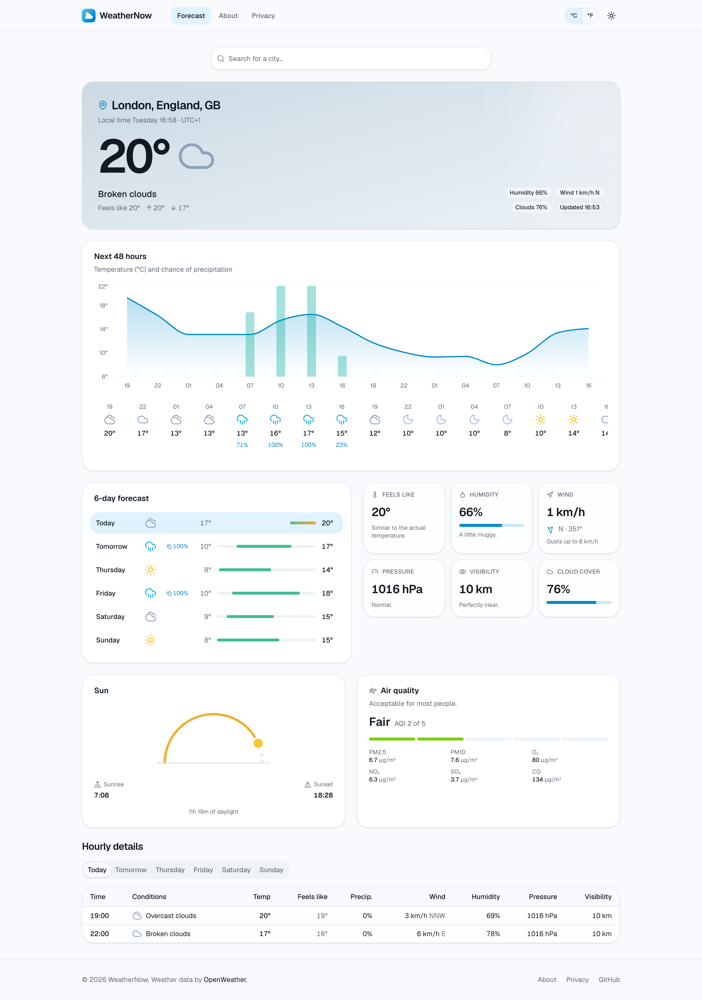
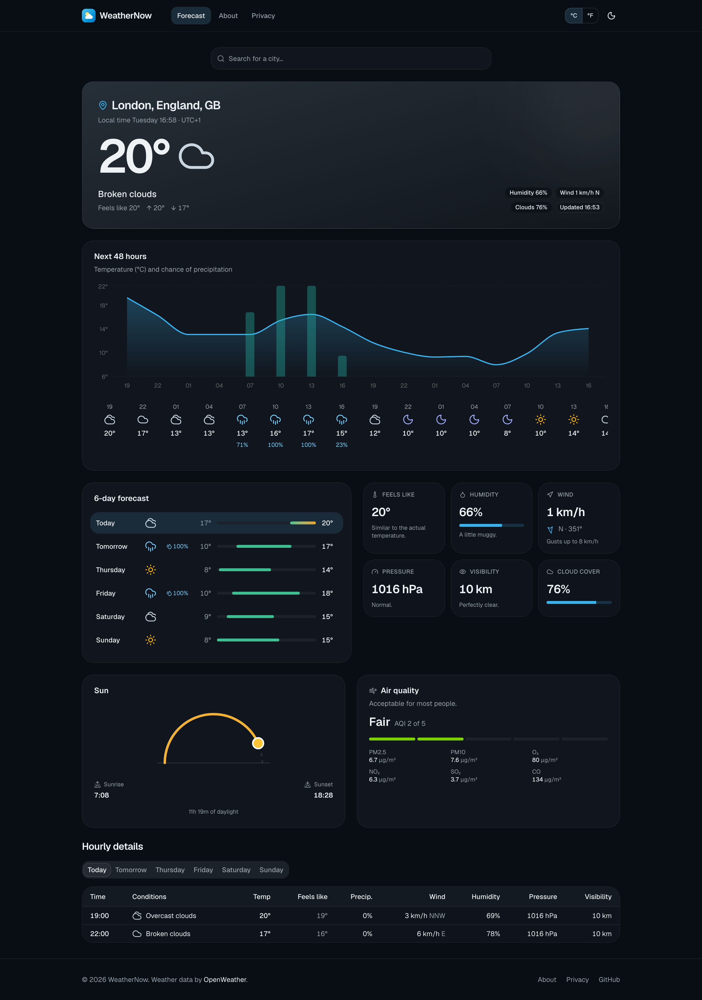
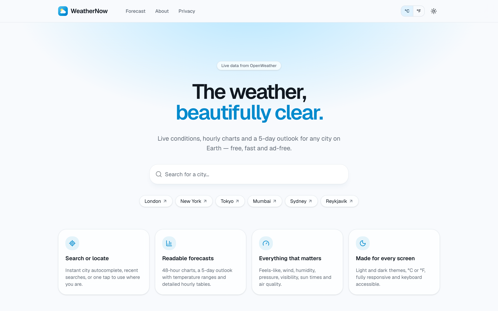
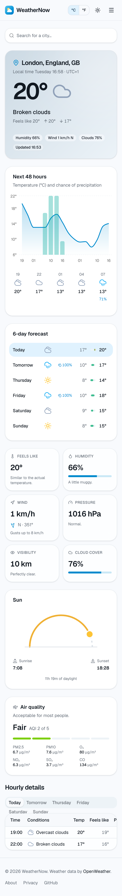
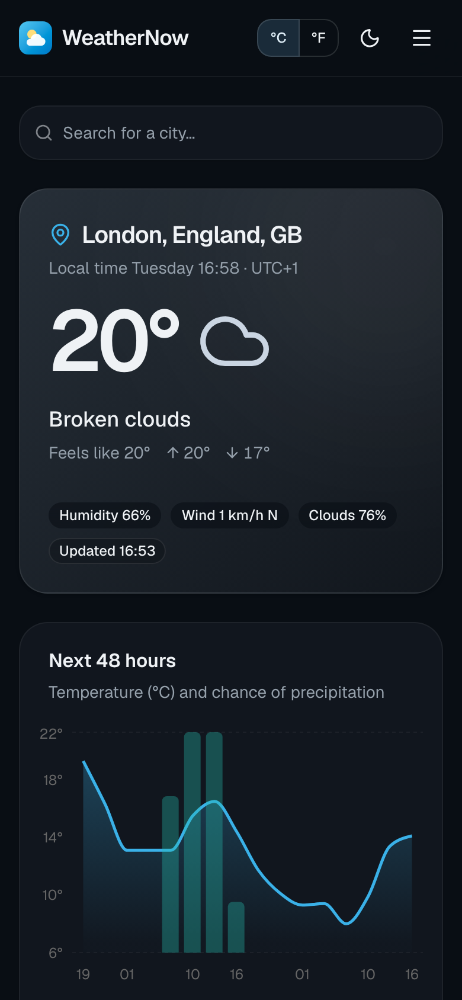

# WeatherNow

**The weather, beautifully clear.** WeatherNow is a fast, accessible weather app for any city on Earth. It shows live conditions, a 48-hour temperature and precipitation chart, a 5-day outlook, sun times, air quality, and a detailed three-hourly breakdown.

**Live:** https://react-acko-weather-app.vercel.app

<p align="center">
  
  
</p>

<p align="center">
  
  
  
</p>

## Features

- **Search or locate:** debounced city autocomplete, recent searches, and one-tap geolocation.
- **Shareable URLs:** every forecast lives at `/weather?lat=…&lon=…&name=…`, so you can bookmark or share it.
- **Readable data:**
  - a current-conditions hero tinted to match the weather
  - a 48-hour chart that combines temperature with chance of rain
  - 5-day temperature range bars
  - metric tiles with plain-language hints
  - a sunrise/sunset arc
  - an AQI card
  - per-day hourly tables
- **Your preferences:** light, dark or system theme with no flash on load, and °C or °F. Both are saved locally.
- **Accessible:** semantic landmarks, a skip link, keyboard-navigable combobox and tabs, screen-reader labels, and respect for reduced-motion settings.
- **SEO-ready:**
  - per-route `<title>`, description and canonical tags, using React 19 metadata
  - Open Graph and Twitter cards
  - JSON-LD
  - a sitemap and `robots.txt`
- **Fast:** route-level code splitting, long-lived vendor chunks, self-hosted variable fonts, and React Query caching with request de-duplication.

## Tech stack

| Area        | Choice                                                                                                                    |
| ----------- | ------------------------------------------------------------------------------------------------------------------------- |
| UI          | React 19, TypeScript 6 (strict, `noUncheckedIndexedAccess`)                                                               |
| Build       | Vite 8 (Rolldown)                                                                                                         |
| Data        | TanStack Query v5                                                                                                         |
| Routing     | React Router 8                                                                                                            |
| Styling     | Tailwind CSS v4, shadcn/ui (Radix), Geist font, lucide icons                                                              |
| Charts      | Recharts via shadcn `chart`                                                                                               |
| Testing     | Vitest 5, Testing Library, jsdom                                                                                          |
| Quality     | ESLint 10 (typescript-eslint, React Compiler hooks rules), Prettier                                                       |
| Hosting     | Vercel                                                                                                                    |
| Data source | [OpenWeather](https://openweathermap.org/api) free tier: current weather, 5-day/3-hour forecast, geocoding, air pollution |

## Architecture

Data flows in one direction through clearly separated layers:

```
OpenWeather API
     │  raw JSON, typed by  src/apiTypes/
     ▼
src/api/          owmFetch() + endpoint functions (the only code that calls fetch)
     │
     ▼
src/converters/   pure functions: apiTypes → frontendTypes (timezones, daily grouping, icons)
     │
     ▼
src/hooks/        React Query hooks (useForecast, useCurrentWeather, useLocationSearch, …)
     │  frontendTypes only
     ▼
src/components/   ui/ (shadcn) · layout/ · weather/
     │
     ▼
src/pages/        Home · Weather · About · Privacy · 404
```

```
src/
├── api/             HTTP client, ApiError, endpoint functions
├── apiTypes/        Raw OpenWeather response shapes
├── frontendTypes/   UI domain types (Forecast, DailySummary, CurrentConditions, …)
├── converters/      apiTypes → frontendTypes mappers (+ unit tests)
├── hooks/           Query hooks, geolocation, recents, debounce, localStorage
├── providers/       QueryClient, Theme, Units, Router, Toaster
├── components/
│   ├── ui/          shadcn/ui primitives
│   ├── layout/      Header, footer, SEO, error boundary, toggles
│   └── weather/     Search, hero, chart, daily list, metrics, sun, AQI, table
├── pages/           Route components (lazy-loaded)
├── lib/             Formatting, routes, constants, cn()
├── config/          Typed environment access
└── test/            Fixtures, render helpers, setup
```

[docs/ARCHITECTURE.md](docs/ARCHITECTURE.md) covers the layer rules and conventions.

## Getting started

**Prerequisites:** [Bun](https://bun.sh) 1.2+ (or Node 22+ with npm), and a free [OpenWeather API key](https://home.openweathermap.org/api_keys).

```bash
git clone https://github.com/iamsomraj/React-Acko-Weather-App.git
cd React-Acko-Weather-App
bun install
cp .env.example .env    # then set VITE_OPENWEATHER_API_KEY
bun run dev             # http://localhost:3000
```

> **Note:** `VITE_*` variables are inlined into the client bundle, so the OpenWeather key is visible to anyone who loads the site. Use a free-tier key, and rotate it if it gets abused.

### Scripts

| Command               | What it does                                                                                                                           |
| --------------------- | -------------------------------------------------------------------------------------------------------------------------------------- |
| `bun run dev`         | Start the dev server with HMR and React Query Devtools                                                                                 |
| `bun run build`       | Type-check and build to `dist/`                                                                                                        |
| `bun run preview`     | Serve the production build locally                                                                                                     |
| `bun run test`        | Run the Vitest suite once (`test:watch` for watch mode)                                                                                |
| `bun run lint`        | Run ESLint                                                                                                                             |
| `bun run typecheck`   | Run `tsc -b`                                                                                                                           |
| `bun run format`      | Format with Prettier (Tailwind class sorting included)                                                                                 |
| `bun run screenshots` | Regenerate `docs/screenshots/*`, `og-image.png` and the touch icon (needs `bun run build` first and `npx playwright install chromium`) |

## Testing

The suite covers:

- **Converters:** timezone-aware day grouping, aggregation and condition selection.
- **API client:** error mapping, aborts.
- **Hooks:** unit switching refetches, debounced search, geolocation, recents syncing.
- **Components:** search combobox, hero, daily list.
- **Routing:** the full dashboard, error state, 404, and the legacy redirect.

Network calls are mocked at `fetch` with typed fixtures from `src/test/fixtures`.

## Deployment (Vercel)

`vercel.json` configures:

- the Bun install and build
- SPA rewrites, so deep links like `/weather?lat=…` survive a refresh
- immutable caching for hashed assets
- basic security headers

To deploy:

```bash
vercel link
vercel env add VITE_OPENWEATHER_API_KEY   # for Preview and Production
vercel deploy          # preview
vercel deploy --prod   # production
```

If you connect the GitHub repository in the Vercel dashboard, every pull request gets its own preview URL.
